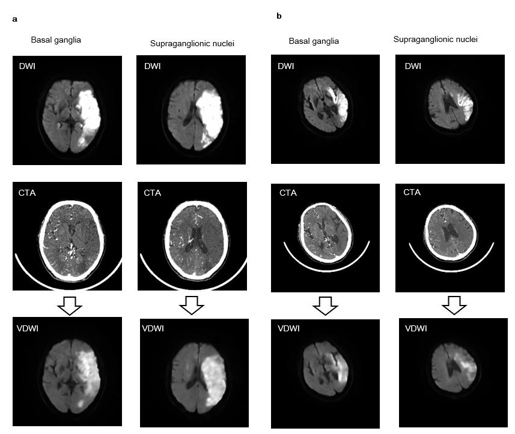

# CTA2VDWI
a brain deep learning project to generate DWI images from CTA images

## Papers and Presentation

## Enviroment/Preparation

```
conda create --name cta2vdwi --file requirements.txt
source activate cta2vdwi
```

## Dataset

a cta sample demo in `./data`

```
.
├── data
│   ├── 4402594_first_BS_NCCT_fake.nii.gz
│   ├── 4402594_first_BS_NCCT.nii.gz
│   └── 4402594_first_FU_DWI_BXXX.nii.gz

```

## Train

## Inference

```
CUDA_VISIBLE_DEVICES=0 python ./predict/cta/predict.py
```

## Test result



## Contributing
